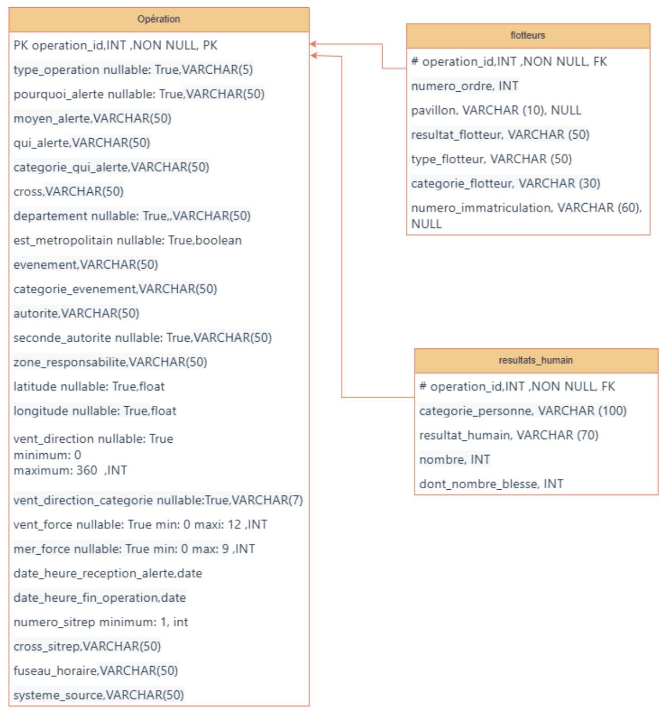

# Brief-3-Gestion-donnees-int-analytique-Blank-Spawn
- Gestion de données et interface analytique

## Contexte
Projet de centralisation et visualisation des données pour le département de surveillance et sauvetage.

## 🎯 Objectifs
- Récupérer et nettoyer les données
- Centraliser dans une base (SQLite/Postgres)
- Créer une interface CRUD et un dashboard analytique (Streamlit/Power BI)
- Documenter et tester (Pytest, Pandera)

## 🛠️ Stack technique
Python, Pandera, Streamlit, Pytest, SQLite/Postgres, Docker

## 📁 Explication de la structure du projet

Le point d'entrée du pipeline: `pipeline/main.py`

Dossiers:
- pipeline - contient tous les fichiers en lien direct avec l'éxecution du flux ETL.
- streamlit_app - code streamlit pour les end users
- support_tools - répertorie les scripts utilisés tout au long du développement du projet
- tests - répertorie les fonctions de test, à utiliser avec pytest

## 🚀 Lancement du projet en local

### Installation des dépendances
Avant de lancer les tests, assurez-vous d'installer les dépendances :
```bash
pip install -r requirements.txt
```

### Activation de l'environnement virtuel
Activez l'environnement virtuel Python :
```bash
source .venv/bin/activate
```

### Fichiers d'environnement
Le projet utilisant une base de données hébergée en ligne, nous utilisons des fichiers d'environnement pour stocker des variables nécessaires à la connexion en BDD.
Un premier fichier `.env` à placer à la racine du projet:

Les données nécessaires dans ces fichiers
- SUPABASE_URL= `URL de connexion à Supabase`
- SUPABASE_KEY= `clé Supabase`
- user= `utilisateur de base de données`
- password= `mot de passe utilisateur`
- host= `IP/Nom d'hôte pour la connexion à la base`
- port= `port de connexion`
- dbname= `nom de la base`

### Lancement
```bash
python3 pipeline/main.py
```

## 🐳 Lancement du projet avec Docker Compose

Pour utiliser Docker Compose afin de lancer la base de données PostgreSQL localement :

### Prérequis
- Docker et Docker Compose installés sur votre machine.
- Fichier `.env` configuré avec les variables d'environnement nécessaires (voir section "Fichiers d'environnement").

### Démarrage de la base de données
```bash
docker-compose up -d
```
Cette commande lance le conteneur PostgreSQL en arrière-plan. Le service sera accessible sur le port défini dans la variable `POSTGRES_PORT` du fichier `.env`.

### Arrêt de la base de données
```bash
docker-compose down
```
Cela arrête et supprime les conteneurs lancés par Docker Compose.

Après avoir démarré la base de données avec Docker Compose, vous pouvez lancer le pipeline comme indiqué dans la section "Lancement du projet en local".

## Structure de la base
<div align="center">
  
</div>

## ✅ Tests unitaires et Couverture

### Exécution des tests
Pour exécuter tous les tests du projet :
```bash
pytest -v
```

### Vérification de la couverture du code
Pour générer un rapport de couverture du code :
```bash
pytest --cov=src --cov-report=term-missing
```
Le rapport sera généré directement dans le terminal.